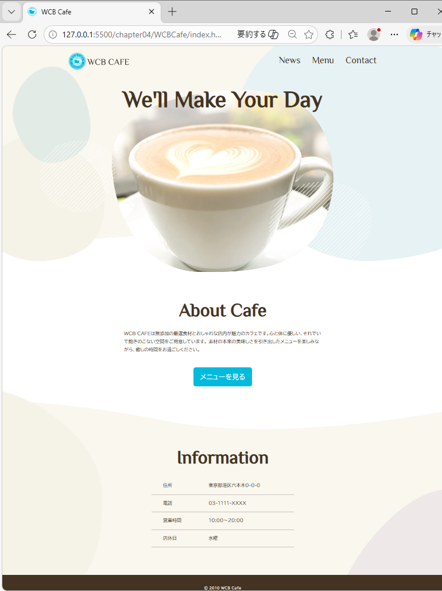
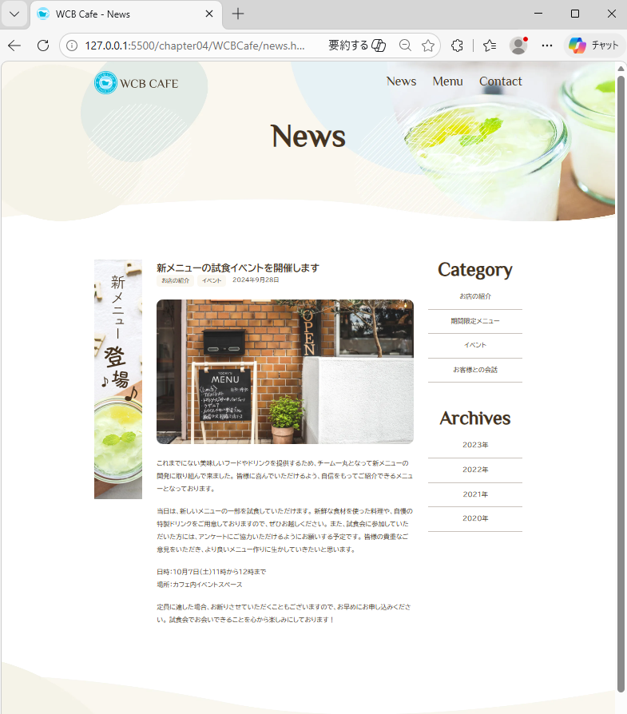
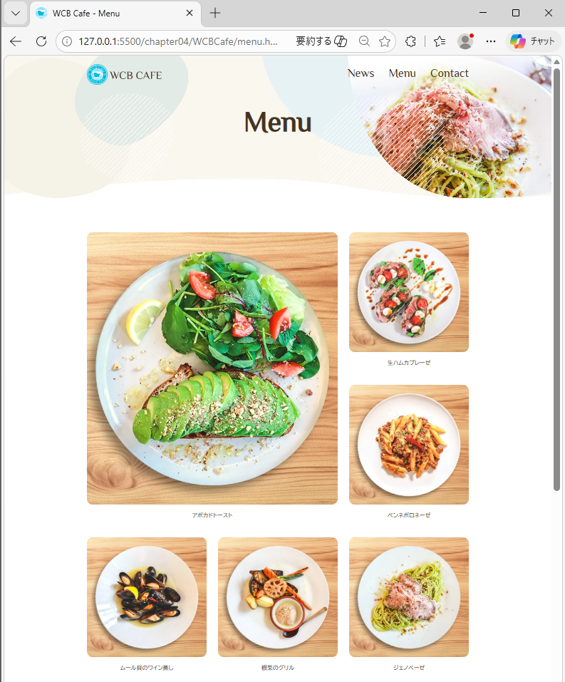
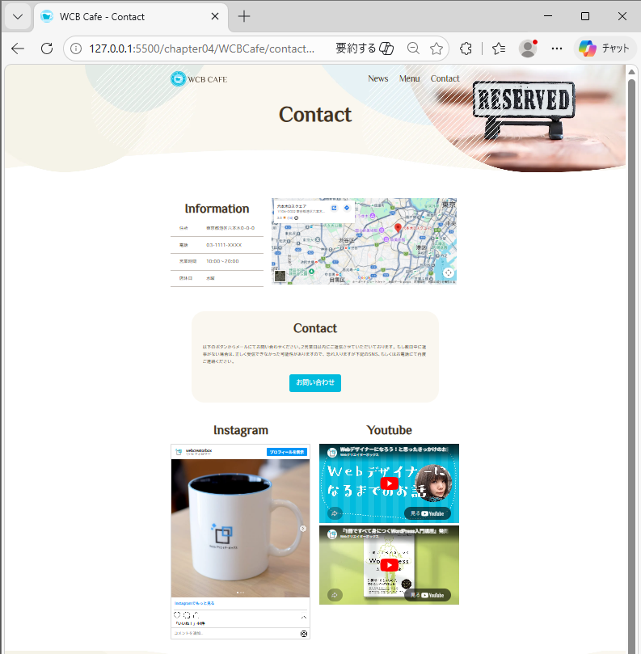

# カフェサイト作成

## 作成経緯
HTML及びCSSのコーディング練習のため、カフェの模擬サイトひな形を作成した。
セマンティックなマークアップ、およびCSSレイアウト（Flexbox/Grid）の習得を目的としている。

## 作成したサイトの例
### 1. トップページ（index.html）
サイトの顔となるメインビジュアルと、コンセプトを配置。

### 2. お知らせページ（news.html）
新メニューや営業時間変更などの情報を掲載するリスト形式のページ。

### 3. メニューページ（menu.html）
提供しているドリンクやフードをカテゴリー別に紹介。

### 4. お問い合わせページ（contact.html）
予約や質問を受け付けるためのフォーム画面。

## 使用技術
- HTML5
- CSS3（レスポンシブデザイン対応）

## 特徴・こだわったポイント
- **レスポンシブ対応**: スマートフォン、タブレット、PCそれぞれのデバイスで最適に表示されるよう調整。
- **共通パーツの統一**: ナビゲーションメニューやフッターのスタイルを全ページで統一し、回遊性を高めた。
- **視覚的な訴求**: カフェの雰囲気に合わせたフォント選びと配色。

## 構成ファイル
- `index.html`: トップページ
- `news.html`: お知らせ一覧
- `menu.html`: メニュー紹介
- `contact.html`: お問い合わせ
- `style.css/`: スタイルシート格納フォルダ
- `images/`: サイト内で使用した画像素材